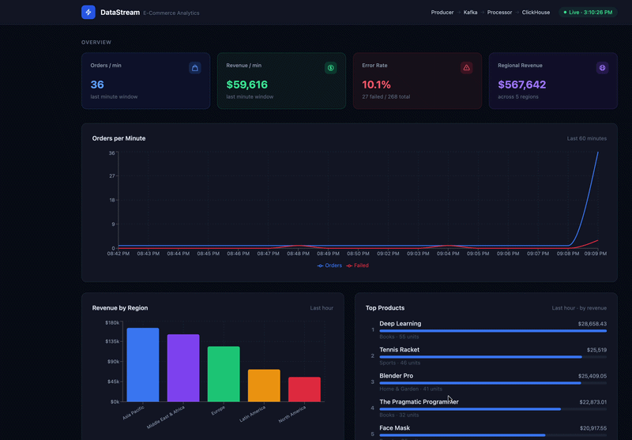
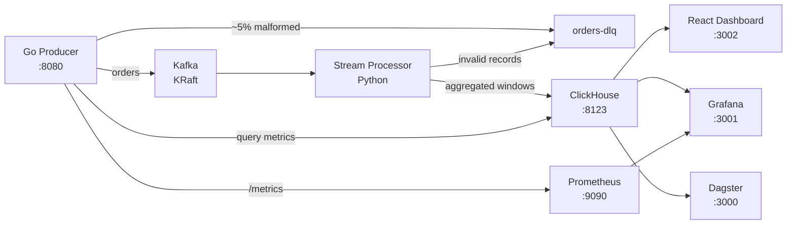
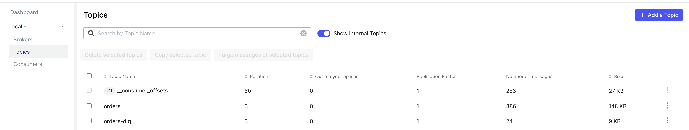

# DataStream — Real-Time E-Commerce Pipeline

A production-grade streaming data pipeline built entirely with open-source tools. Generates synthetic e-commerce orders, streams them through Kafka, aggregates in real-time, and visualises on a live dashboard.



---

## Architecture



---

## Kafka — Topics



---

## Tech Stack

| Layer | Technology | License |
|-------|-----------|---------|
| Event Streaming | Apache Kafka 3.7 (KRaft, no Zookeeper) | Apache 2.0 |
| Stream Processing | Python + kafka-python (custom tumbling windows) | Apache 2.0 |
| Analytics DB | ClickHouse 23.8 | Apache 2.0 |
| API / Producer | Go + Gin | MIT |
| Orchestration | Dagster | Apache 2.0 |
| Monitoring | Prometheus | Apache 2.0 |
| Dashboards | Grafana OSS | AGPL-3.0 |
| Frontend | React + TypeScript + Recharts + Tailwind | MIT |
| Container Runtime | Docker Compose | Apache 2.0 |

---

## Services & Ports

| Service | URL | Description |
|---------|-----|-------------|
| React Dashboard | http://localhost:3002 | Live analytics frontend |
| Go API | http://localhost:8080 | REST API + order generator |
| Go Metrics | http://localhost:8080/metrics | Prometheus scrape endpoint |
| Kafka UI | http://localhost:8090 | Browse topics & messages |
| Dagster | http://localhost:3000 | Pipeline orchestration |
| Grafana | http://localhost:3001 | Pre-built dashboards (admin/admin) |
| Prometheus | http://localhost:9090 | Metrics storage |
| ClickHouse HTTP | http://localhost:8123 | Direct SQL queries |

---

## Prerequisites

- Docker Desktop ≥ 4.x with at least **8 GB RAM** allocated
- Docker Compose v2 (`docker compose` command)

---

## Quick Start

```bash
# 1. Clone the repo
git clone https://github.com/SriramAtmakuri/DataStream.git
cd DataStream

# 2. Start all services
docker compose up --build

# 3. Open the dashboard
open http://localhost:3002
```

Data starts flowing immediately. The stream processor writes aggregated windows to ClickHouse every **1 minute** (`orders_per_minute`) and every **5 minutes** (`revenue_by_region`, `top_products`). The React dashboard polls every 5 seconds.

---

## API Endpoints

```
POST   /api/orders                    Create a single order manually
GET    /api/orders/stats              Generator status
GET    /api/metrics/orders-per-minute Orders per minute (last 60 min)
GET    /api/metrics/revenue-by-region Revenue grouped by region (last 1h)
GET    /api/metrics/top-products      Top 10 products by revenue (last 1h)
GET    /api/metrics/error-rate        Failed order rate (last 5 min)
GET    /health                        Health check
GET    /metrics                       Prometheus metrics
```

### Create an order manually

```bash
curl -X POST http://localhost:8080/api/orders \
  -H 'Content-Type: application/json' \
  -d '{
    "product": "Laptop Pro",
    "category": "Electronics",
    "quantity": 2,
    "price": 999.99,
    "region": "Europe",
    "status": "completed"
  }'
```

---

## Key Design Decisions

### Late Data & Out-of-Order Events
- Go generator intentionally **backdates 10% of events** by up to 30 seconds to simulate real-world out-of-order delivery.
- Stream processor uses **10-second late tolerance** — events arriving up to 10 seconds late are still included in the correct window.

### Dead Letter Queue
- ~5% of generated orders are deliberately malformed and routed directly to `orders-dlq` Kafka topic.
- Stream processor sends any unparseable JSON to the DLQ.
- DLQ messages stored in ClickHouse `dead_letter_queue` table for analysis.
- Dagster runs a DLQ report job every 15 minutes.

### Tumbling Windows
| Window | Destination Table | Interval |
|--------|------------------|----------|
| 1-minute | `orders_per_minute` | Every minute |
| 5-minute | `revenue_by_region` | Every 5 minutes |
| 5-minute | `top_products` | Every 5 minutes |

### Prometheus Metrics (Go API)
| Metric | Type | Description |
|--------|------|-------------|
| `orders_published_total` | Counter | Successfully published orders |
| `orders_failed_total` | Counter | Failed publishes |
| `orders_dlq_total` | Counter | Orders sent to DLQ |
| `orders_revenue_total` | Counter | Cumulative revenue ($) |

---

## ClickHouse Queries

```sql
-- Orders per minute (last 5 min)
SELECT minute, order_count, failed_count
FROM ecommerce.orders_per_minute
WHERE minute >= now() - INTERVAL 5 MINUTE
ORDER BY minute;

-- Revenue by region (last hour)
SELECT region, round(sum(total_revenue), 2) AS revenue
FROM ecommerce.revenue_by_region
WHERE window_start >= now() - INTERVAL 1 HOUR
GROUP BY region ORDER BY revenue DESC;

-- Top products (last hour)
SELECT product, sum(quantity_sold) AS qty, round(sum(total_revenue), 2) AS revenue
FROM ecommerce.top_products
WHERE window_start >= now() - INTERVAL 1 HOUR
GROUP BY product ORDER BY revenue DESC LIMIT 10;

-- Failed order rate (last 5 min)
SELECT countIf(status='failed') * 100.0 / count() AS error_pct
FROM ecommerce.orders
WHERE timestamp >= now() - INTERVAL 5 MINUTE;

-- DLQ last 24h
SELECT toStartOfHour(failed_at) AS hr, count() AS failures
FROM ecommerce.dead_letter_queue
WHERE failed_at >= now() - INTERVAL 24 HOUR
GROUP BY hr ORDER BY hr;
```

---

## Dagster Pipelines

Open http://localhost:3000 → **Assets** to run:

| Asset | Schedule | Description |
|-------|----------|-------------|
| `daily_order_summary` | Every hour | Daily KPI snapshot to ClickHouse |
| `product_performance` | Every hour | 24h product revenue aggregation |
| `dlq_report` | Every 15 min | Dead-letter queue failure report |

---

## Configuration

| Variable | Default | Description |
|----------|---------|-------------|
| `ORDERS_PER_SECOND` | `5` | Order generation rate |
| `KAFKA_BROKERS` | `kafka:9092` | Kafka bootstrap servers (Docker) / `localhost:9094` (local) |
| `KAFKA_TOPIC_ORDERS` | `orders` | Main orders topic |
| `KAFKA_TOPIC_DLQ` | `orders-dlq` | Dead letter queue topic |
| `CLICKHOUSE_HOST` | `clickhouse` | ClickHouse hostname |

Copy `.env.example` to `.env` to override for local development outside Docker.

---

## Stopping / Cleanup

```bash
# Stop all services
docker compose down

# Stop and remove all data volumes
docker compose down -v
```

---

## Troubleshooting

**No data in dashboard after startup:**
- Wait 2-3 minutes — windows aggregate on 1-5 minute intervals
- Check ClickHouse: http://localhost:8123/play → `SELECT count() FROM ecommerce.orders`

**Stream processor restarting:**
```bash
docker compose logs stream-processor
```

**ClickHouse tables empty:**
```bash
docker compose logs stream-processor | grep -i "error"
```

**Port conflict:**
Edit `docker-compose.yml` and change the host port (left side of `:`).
